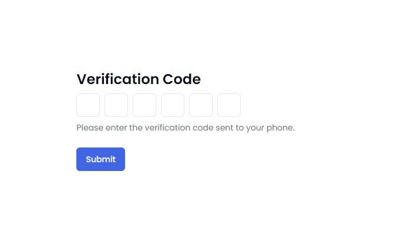

# User OTP Verification Application

## Overview

This repository contains a small application built to facilitate user verification through inputting 6-digit codes. The application is designed to be simple yet robust, allowing users to manually input the code or paste it from the clipboard. It features validation for ensuring data integrity and communicates with a server built on Express.js for processing verification requests.



## Features

- Input field for manually entering 6-digit codes.
- Option to paste codes from the clipboard.
- Automatic focus on the next input field after entering a digit.
- Client-side validation to ensure inputs are numeric and filled.
- POST request handling to the server.
- Error handling for verification failures.
- Success redirection upon successful verification.

## Technologies Used

- **Frontend:** React with Typescript
- **Backend:** Express.js with Typescript
- **Testing:** Jest (for tests)

## Setup Instructions

1. **Clone the Repository:**

   ```bash
   git clone <repository_url>
   ```

2. **Install Dependencies:**

   - For the client:

     ```bash
     cd client
     yarn install
     ```

   - For the server:

     ```bash
     cd server
     yarn install
     ```

3. **Start the Server:**

   ```bash
   cd server
   yarn start
   ```

4. **Start the Client:**

   ```bash
   cd client
   yarn start
   ```

## Usage

1. Enter the 6-digit code either manually or by pasting from the clipboard.
2. Upon entering the code, the browser will automatically focus on the next input field if available.
3. Click the submit button.
4. If the code is successfully verified, you will be redirected to the `/success` route.
5. If there's an error during verification, a "Verification Error" message toast will be displayed on the page.

## Server-side Logic

- The server verifies the received code against simple rules:
  - If the code is not exactly 6 digits long OR if the last digit is 7, it returns an error.
  - Otherwise, it treats the request as a success.

## Client-side Validation

- Inputs are validated to ensure they are numeric and filled.
- If any input is empty or contains non-numeric characters, it will be highlighted.
- The highlight is removed as soon as valid input is entered.

## Tests

- Tests are implemented using Jest to ensure the application functions as expected.
